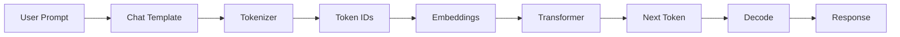

# Embeddings

> "Embeddings transform token IDs into dense vectors that capture semantic meaning."

**Difficulty:** 🟢 Beginner  
**Estimated Reading Time:** 15 minutes  
**Prerequisites:** Training vs Inference  
**Last Updated:** July 2026

---

# Learning Objectives

By the end of this chapter, you will understand:

- Why token IDs are not enough
- What embeddings are
- How the embedding layer works
- What an embedding matrix is
- Why similar words have similar embeddings
- How embeddings become the input to the Transformer

---

# Why Should I Care?

In the previous chapter, we learned that the tokenizer converts text into token IDs.

For example:

```
"I love AI"

↓

[40, 3021, 15836]
```

But here's the question:

Can a Transformer understand the number **15836**?

The answer is **no**.

To the model, `15836` is simply an identifier. It doesn't contain any information about the meaning of the word.

Before the Transformer can process language, each token ID must be converted into a meaningful numerical representation.

That representation is called an **embedding**.

---

# The Big Idea

Think of token IDs like student roll numbers.

```
Roll Number

↓

1024
```

Does the number **1024** tell you anything about the student?

No.

It is simply an identifier.

Similarly,

```
Token ID

↓

15836
```

is only an identifier.

The embedding layer transforms that identifier into a dense vector that the Transformer can understand.

---

# How It Works

The complete pipeline now looks like this:



```

The Transformer **never processes raw text**.

It also **never processes token IDs directly**.

Its real input is a sequence of embedding vectors.

---

# Why Token IDs Are Not Enough

Imagine these IDs:

| Word | Token ID |
|------|---------:|
| Apple | 101 |
| Mango | 102 |
| Car | 103 |

From these IDs alone:

- Is Apple similar to Mango?
- Is Apple more similar to Car?

The answer is no.

The IDs contain no semantic information.

They are simply indexes.

---

# What is an Embedding?

An embedding is a dense vector of floating-point numbers.

Example:

```
Token ID

15836

↓

Embedding

[0.41, -0.28, 0.97, ..., 1.24]
```

Instead of one integer,

the model now has hundreds or thousands of values describing that token.

Modern LLMs commonly use embedding dimensions such as:

- 768
- 1024
- 4096
- 8192

The exact size depends on the model architecture.

---

# The Embedding Matrix

Where do these vectors come from?

They are stored in a large learnable table called the **embedding matrix**.

Conceptually:

```
Embedding Matrix

+--------------------------------------+
| Token ID | Embedding Vector          |
+--------------------------------------+
| 0        | [ ... ]                   |
| 1        | [ ... ]                   |
| 2        | [ ... ]                   |
| ...      | ...                       |
| 15836    | [0.41, -0.28, ...]        |
+--------------------------------------+
```

When the tokenizer produces:

```
15836
```

the model simply performs a lookup:

```
Embedding = EmbeddingMatrix[15836]
```

No search is involved.

It is a direct index lookup.

---

# Example Pipeline

Input:

```
I love AI
```

Step 1

```
Tokenizer

↓

[40, 3021, 15836]
```

Step 2

```
Embedding Layer

↓

[
Vector₁,
Vector₂,
Vector₃
]
```

These vectors are then passed to the Transformer.

---

# Why Similar Words Have Similar Embeddings

One of the remarkable properties of embeddings is that semantically similar words often have similar vectors.

For example:

```
Doctor
Nurse
Hospital
```

tend to be closer together than:

```
Doctor
Banana
Airplane
Ocean
```

The model learns these relationships during training.

This allows it to generalize beyond exact word matches.

---

# Visual Diagram

```
                Tokenizer

"I love AI"
        │
        ▼
[40, 3021, 15836]
        │
        ▼
Embedding Layer
        │
        ▼
┌─────────────┐
│ Vector 1    │
│ Vector 2    │
│ Vector 3    │
└─────────────┘
        │
        ▼
Transformer
```

---

# Code Example

```python
from transformers import AutoTokenizer, AutoModel

tokenizer = AutoTokenizer.from_pretrained(
    "meta-llama/Meta-Llama-3.1-8B"
)

model = AutoModel.from_pretrained(
    "meta-llama/Meta-Llama-3.1-8B"
)

inputs = tokenizer(
    "Hello World",
    return_tensors="pt"
)

outputs = model(**inputs)
```

Although we don't explicitly create embeddings in this code, the model performs the embedding lookup automatically before the Transformer layers begin processing.

---

# Engineering Notes

- The embedding layer is the first learnable layer of an LLM.
- Embeddings are updated during training using backpropagation.
- The embedding matrix often contains tens or hundreds of millions of parameters.
- Larger models usually have higher-dimensional embeddings.

---

# Common Misconceptions

### ❌ Token IDs contain meaning.

No.

They are simply identifiers.

The meaning comes from the embedding vectors.

---

### ❌ The tokenizer creates embeddings.

No.

The tokenizer only produces token IDs.

The embedding layer inside the model converts those IDs into vectors.

---

### ❌ Embeddings are fixed.

No.

They are learned during training and continue to improve as training progresses.

---

# Interview Questions

### What is an embedding?

An embedding is a dense vector representation of a token that captures semantic information.

---

### Why can't we feed token IDs directly into the Transformer?

Because token IDs are arbitrary integers that contain no semantic meaning.

---

### What is an embedding matrix?

A learnable lookup table that maps every token ID to a dense vector.

---

### How are embeddings learned?

They are initialized randomly and updated during training through backpropagation.

---

# 🧠 First Principles

A Transformer understands vectors—not words and not token IDs.

The embedding layer is responsible for translating token IDs into the numerical language of neural networks.

---

# Aha Moment 💡

The tokenizer answers:

> **"Which token is this?"**

The embedding layer answers:

> **"What does this token mean mathematically?"**

Without embeddings, every token would just be an arbitrary number.

---

# Summary

- Token IDs are identifiers.
- Embeddings convert token IDs into dense vectors.
- Similar concepts tend to have similar embeddings.
- The embedding matrix is learned during training.
- The Transformer receives embeddings as its input.

---

# Further Reading

- Attention Is All You Need (2017)
- Word2Vec
- GloVe
- FastText
- Llama 3 Technical Report

---

# Next Chapter

➡️ Positional Encoding

Embeddings capture the meaning of tokens, but they do not capture their order. In the next chapter, we'll learn how Transformers understand the sequence of words.