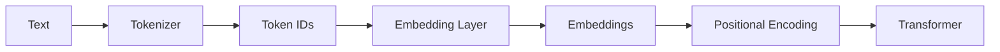

# Chapter 02: Positional Encoding

> "Embeddings tell the Transformer what a token means. Positional Encoding tells it where the token appears."

**Difficulty:** 🟢 Beginner  
**Estimated Reading Time:** 18 minutes  
**Prerequisites:** Embeddings  
**Last Updated:** July 2026

---

# Learning Objectives

By the end of this chapter, you will understand:

- Why embeddings alone are insufficient
- Why Transformers need positional information
- What positional encoding is
- How positional information is added to embeddings
- The difference between Sinusoidal and Learned Positional Encoding
- Why modern LLMs use Rotary Positional Embeddings (RoPE)

---

# Why Should I Care?

Imagine reading these two sentences:

```
Dog bites man.
```

and

```
Man bites dog.
```

Both sentences contain exactly the same words.

Yet they mean completely different things.

How do **you** know they're different?

Because you understand the **order** of the words.

Now imagine you're a Transformer.

After tokenization and embeddings, you only receive vectors.

```
Vector 1

Vector 2

Vector 3
```

How do you know which word came first?

You don't.

This is the problem Positional Encoding solves.

---

# The Big Idea

Embeddings capture **meaning**.

Positional Encoding captures **order**.

Together they form the actual input to the Transformer.

```
Embeddings

+

Position Information

↓

Transformer Input
```

Without positional information, every sentence becomes an unordered collection of tokens.

---

# The Problem

Let's look at two sentences.

```
The cat chased the dog.
```

```
The dog chased the cat.
```

The words are almost identical.

Only their positions have changed.

Without positional information, the Transformer would struggle to distinguish these two sentences correctly.

---

# Why Embeddings Are Not Enough

Suppose the tokenizer produces:

```
[105, 327, 812, 105, 491]
```

The embedding layer converts them into vectors.

```
Vector A

Vector B

Vector C

Vector D

Vector E
```

These vectors capture the meaning of each token.

However, none of them tells the model:

```
This is the first word.

This is the third word.

This is the fifth word.
```

The Transformer needs this information.

---

# What is Positional Encoding?

Positional Encoding adds information about a token's position in the sequence.

Conceptually:

```
Embedding

+

Position

↓

New Embedding
```

Instead of sending only the embedding,

the model sends:

```
Meaning

+

Position
```

to the Transformer.

---

# How It Works

The complete pipeline now looks like this.

```
Text
    │
    ▼
Tokenizer
    │
    ▼
Token IDs
    │
    ▼
Embedding Layer
    │
    ▼
Embeddings
    │
    ▼
Positional Encoding
    │
    ▼
Transformer
```

Now every token contains:

- What it means
- Where it appears

---

# Visual Diagram

## Mermaid Diagram



## ASCII Diagram

```
Text
 │
 ▼
Tokenizer
 │
 ▼
Token IDs
 │
 ▼
Embeddings
 │
 ▼
+ Position
 │
 ▼
Transformer
```

---

# Types of Positional Encoding

Over the years, researchers have developed multiple approaches.

We'll briefly introduce each one.

---

## 1. Sinusoidal Positional Encoding

This was introduced in the original paper:

> **Attention Is All You Need (2017)**

Instead of learning positions,

the model computes them using sine and cosine functions.

```
Position 0

↓

[0.0, 1.0, 0.0, 1.0...]

Position 1

↓

[0.84, 0.54, ...]
```

### Advantages

- No additional parameters
- Can generalize to longer sequences

### Limitation

Modern LLMs have found better alternatives.

---

## 2. Learned Positional Embeddings

Instead of mathematical functions,

the model learns a vector for every position.

Example:

| Position | Vector |
|----------|--------|
| 0 | [...] |
| 1 | [...] |
| 2 | [...] |

These vectors are updated during training just like embeddings.

### Advantages

- Flexible
- Easy to train

### Limitation

Cannot naturally generalize beyond the maximum sequence length seen during training.

---

## 3. Rotary Positional Embeddings (RoPE)

Modern LLMs such as:

- Llama
- Qwen
- Gemma
- Mistral
- DeepSeek

use **RoPE**.

Instead of adding positional vectors,

RoPE rotates the Query and Key vectors in attention.

This allows the model to capture **relative positions** more effectively.

You don't need to understand the mathematics yet.

We'll revisit RoPE when we study Self-Attention.

For now, remember:

> Most modern LLMs use **RoPE**, not the original sinusoidal approach.

---

# Engineering Notes

- The original Transformer paper introduced Sinusoidal Positional Encoding.
- GPT-2 used learned positional embeddings.
- Llama, Mistral, Gemma, Qwen, and DeepSeek use RoPE.
- RoPE enables better handling of long-context inference.

---

# Common Misconceptions

### ❌ Embeddings contain word order.

No.

Embeddings only represent semantic meaning.

---

### ❌ Transformers automatically understand sequence order.

No.

Without positional information, self-attention treats tokens as an unordered set.

---

### ❌ Every Transformer uses the same positional encoding.

False.

Different architectures use different approaches.

---

# Interview Questions

### Why do Transformers need positional encoding?

Because self-attention alone has no notion of token order.

---

### Why aren't embeddings enough?

Embeddings represent meaning but not sequence.

---

### What positional encoding does Llama use?

Rotary Positional Embeddings (RoPE).

---

### What was introduced in the original Transformer paper?

Sinusoidal Positional Encoding.

---

# 🧠 First Principles

The Transformer has no built-in understanding of "first", "second", or "last".

Positional Encoding gives the model a sense of sequence.

Without it, language would lose its structure.

---

# Aha Moment 💡

Embeddings answer:

> "What does this token mean?"

Positional Encoding answers:

> "Where is this token in the sentence?"

Both pieces of information are essential before the Transformer can understand language.

---

# Summary

- Embeddings capture meaning.
- Positional Encoding captures order.
- Both are combined before entering the Transformer.
- The original Transformer used Sinusoidal Positional Encoding.
- Modern LLMs primarily use RoPE.

---

# Further Reading

- Attention Is All You Need (2017)
- RoFormer: Enhanced Transformer with Rotary Position Embedding
- Llama 3 Technical Report

---

# Next Chapter

➡️ Why Attention?

Now that every token has both meaning and position, we'll explore why the Transformer still needed a new mechanism—**Attention**—to understand relationships between words.