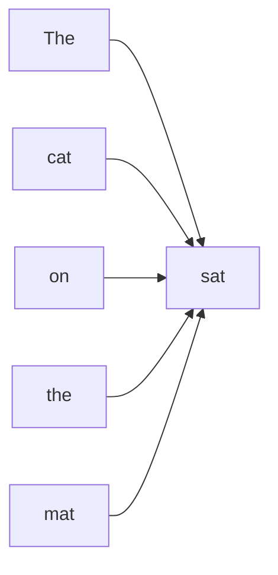

# Chapter 03: Why Attention?

> "Attention was invented because previous sequence models struggled to remember long-range relationships."

**Difficulty:** 🟢 Beginner  
**Estimated Reading Time:** 15 minutes  
**Prerequisites:** Positional Encoding  
**Last Updated:** July 2026

---

# Learning Objectives

By the end of this chapter, you will understand:

- Why RNNs and LSTMs struggled with long sequences
- What problem Attention solves
- Why every token should be able to "look at" every other token
- Why Attention became the foundation of modern LLMs
- How this leads naturally to Self-Attention

---

# Why Should I Care?

Imagine reading this sentence:

```
The animal didn't cross the road because it was too tired.
```

What does **"it"** refer to?

- The road?
- The animal?

As humans, we immediately know that **"it" refers to the animal.**

But how?

Because while reading **"it"**, our brain remembers the earlier word **"animal."**

Language constantly requires us to connect words that are far apart.

A model that cannot remember earlier words will misunderstand many sentences.

---

# The Big Idea

Every word in a sentence can depend on every other word.

Instead of reading words one by one and trying to remember everything,

the model should be able to directly look at the words that matter.

That idea is called **Attention**.

---

# The Problem

Before Transformers, sequence models like **RNNs** and **LSTMs** processed text one token at a time.

```
The

↓

cat

↓

sat

↓

on

↓

the

↓

mat
```

Each word had to wait for the previous word to finish processing.

This introduced several problems.

---

# Problem 1 — Forgetting Long-Term Information

Consider this sentence:

```
The little boy who was playing football in the park after school yesterday dropped his backpack.
```

By the time the model reaches:

```
backpack
```

it may struggle to remember:

```
boy
```

The information has to travel through many intermediate steps.

Some of it gets weakened or lost.

---

# Problem 2 — Sequential Processing

RNNs process tokens one after another.

```
Word 1

↓

Word 2

↓

Word 3

↓

Word 4
```

Notice something important.

The model cannot process Word 4 until Word 3 finishes.

This makes training difficult to parallelize.

---

# Problem 3 — Equal Importance

Not every previous word matters equally.

Consider:

```
The doctor spoke to the patient because she was worried.
```

When processing:

```
she
```

the model should pay much more attention to:

```
doctor

patient
```

than to:

```
the

to

because
```

Traditional sequence models had no simple mechanism for choosing which previous words were most important.

---

# The Idea Behind Attention

Instead of forcing information to travel step by step,

why not allow every token to directly access every other token?

Conceptually:

```
Dog
   ↘
     \
Cat ----> Chased
     /
Mouse
```

Every token can interact with every other token.

This makes understanding long-range relationships much easier.

---

# Visual Diagram

## Mermaid Diagram



Every token has the ability to attend to other relevant tokens.

---

## ASCII Diagram

```
Token 1  ─────┐
              │
Token 2  ─────┼────► Current Token
              │
Token 3  ─────┤
              │
Token 4  ─────┘
```

Unlike RNNs, information doesn't have to pass through every intermediate token.

---

# Why is it called "Attention"?

Think about reading a newspaper.

You don't give every word equal attention.

Your eyes naturally focus on the important words.

Similarly,

the Transformer learns:

> "Which words should I pay attention to when understanding this token?"

Different words receive different levels of importance.

---

# Real-World Analogy

Imagine you're in a meeting.

Several people are talking.

When your manager asks you a question,

you don't replay the entire conversation from the beginning.

Instead,

your brain immediately focuses on the parts that are relevant.

Attention works the same way.

It selectively focuses on useful information instead of treating everything equally.

---

# Engineering Notes

- Attention removes the need to compress all information into a single hidden state.
- Every token can directly access information from other tokens.
- Attention enables parallel processing across tokens.
- Modern LLMs such as GPT, Llama, Gemma, and Qwen are built on Attention mechanisms.

---

# Common Misconceptions

### ❌ Attention remembers everything.

No.

It learns which tokens are most relevant for the current token.

---

### ❌ Attention replaces embeddings.

No.

Embeddings represent token meaning.

Attention models relationships between tokens.

---

### ❌ Attention understands language by itself.

No.

It is one component of the Transformer architecture.

---

# Interview Questions

### Why were RNNs replaced by Transformers?

Because RNNs struggle with long-range dependencies and process sequences sequentially.

Transformers use Attention, which captures long-range relationships while enabling parallel computation.

---

### What problem does Attention solve?

It allows each token to directly access information from other relevant tokens in the sequence.

---

### Why is Attention important?

Because understanding language often requires connecting words that are far apart.

---

# 🧠 First Principles

Language is not just about understanding individual words.

It is about understanding the relationships between words.

Attention was invented to model those relationships efficiently.

---

# Aha Moment 💡

Instead of asking:

> "What is the next word?"

the Transformer asks:

> **"Which previous words should I look at before deciding?"**

That single idea changed Natural Language Processing forever.

---

# Summary

- RNNs process text sequentially.
- Long-range information is difficult for RNNs to preserve.
- Attention allows every token to access every other token directly.
- Different tokens receive different levels of importance.
- Attention became the foundation of modern Transformers.

---

# Further Reading

- Attention Is All You Need (2017)
- The Illustrated Transformer – Jay Alammar

---

# Next Chapter

➡️ Self-Attention

Now that we understand **why Attention was invented**, we'll explore **how Self-Attention actually works** inside a Transformer.